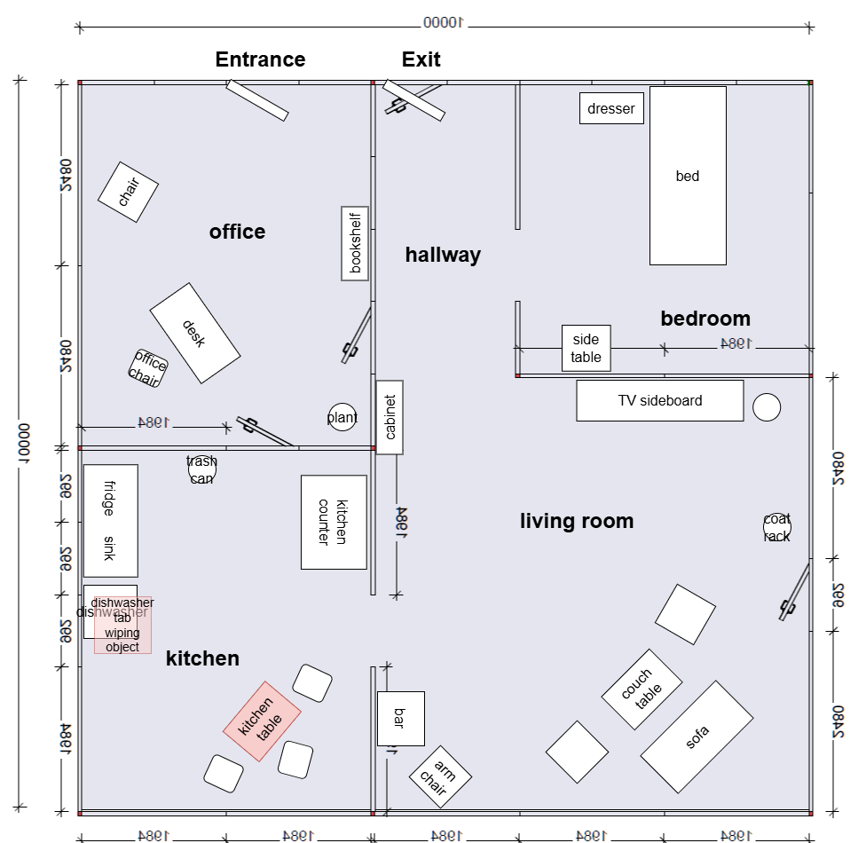

# German Open 2025

## Table of Contents

- [Scores](#scores)
- [Schedule](#schedule)
    + [Mapping Slots](#mapping-slots)
- [Arena](#arenas)
- [Robot Inspection and Poster Session](#robot-inspection-and-poster-session)
- [Stage 1](#stage-1)
    + [Receptionist](#receptionist)
    + [Storing Groceries](#storing-groceries)
    + [Carry my Luggage](#carry-my-luggage)
    + [GPSR](#gpsr)
- [Stage 2](#stage-2)
    + [Clean the Table](#clean-the-table)
    + [Stickler for the Rules](#stickler-for-the-rules)
    + [EGPSR](#egpsr)

## Scores

| Team name | Score Stage 1+2 | Rank (Stage 1+2) | Score 50% (Stage 1+2) | Final | Score 50% (Final) | FInal Score | Rank |
| --------- | --------------- | ---------------- | --------------------- | ----- | ----------------- | ----------- | ---- |
| NimbRo    | 4,321.25        | 1                | 50.00                 | 1795  | 50.00             | 100.00      | 1    |
| ToBI      | 1,551.25        | 2                | 17.95                 | 610   | 16.99             | 34.94       | 2    |
| SCC       | 1,498.75        | 3                | 17.34                 | 150   | 4.18              | 21.52       | 3    |
| SUTURO    | 1,130.00        | 4                | 13.07                 |       | 0.00              | 13.07       | 4    |
| b-it-bots | 50.00           | 5                | 0.58                  |       | 0.00              | 0.58        | 5    |
|           |                 |                  |                       |       |                   |             |      |

Scores can be found [here](scores.md)

## Schedule

|        | Mi 12.              | Do. 13.             | Fr 14.              | Sa 15.              | So 16. |
|--------|---------------------|---------------------|---------------------|---------------------|--------|
| 10:00  |                     | Robot Inspection    | Storing Groceries   | EGPSR               |        |
| 12:00  |                     |                     |                     |                     | Finals |
| 13:00  |                     | Receptionist        | Help me Carry       | Clean The Table     |        |
| 16:00  | Team Leader Meeting | GPSR                | Stickler            | Restaurant          |        |
| 17:00  | Robot Inspection    |                     |                     |                     |        |
| 18:30  | Welcome Reception   |                     |                     |                     |        |
| 19:30  | Poster Session      | Team Leader Meeting | Team Leader Meeting | Team Leader Meeting |        |
| 20:00  | Poster Reception    |                     |                     |                     |        |

## Arena

## Robot Inspection and Poster Session
On 12.03.2025 17:00 (Robot Inspection)

| Ordering | Team Name |
|----------|-----------|
| 1        | b-it bots |
| 2        | NimbRo    |
| 3        | SCC       |
| 4        | ToBI      |
| 5        | Suturo    |

## Mapping Slots
On 12.03.2025 18:00 (10min per Team)

| Ordering | Team Name |
|----------|-----------|
| 1        | b-it bots |
| 2        | SCC       |

Please hang your poster in the office on a free wall.

## Stage 1

|   | Receptionist: 3/13, 13:00 | GPSR: 3/13, 16:00 | Storing Groceries: 3/14, 10:00 | Help Me Carry: 3/14, 13:00 |
|---|---------------------------|-------------------|--------------------------------|----------------------------|
| 1 | b-it-bots                 | SCC               | ToBI                           | SUTURO                     |
| 2 | SCC                       | SUTURO            | b-it-bots                      | NimbRo                     |
| 3 | ToBI                      | NimbRo            | SUTURO                         | SCC                        |
| 4 | SUTURO                    | ToBI              | NimbRo                         | b-it-bots                  |
| 5 | NimbRo                    | b-it-bots         | SCC                            | ToBI                       |

### Receptionist

Announce host's **favorite drink**: iced_tea

Announce host's **name**: James

Announce host's **interest**: interest in robots

### Storing Groceries

Announce which table will be used
Announce what will be used as cabinet

Announce **tiny objects**: dishwasher_tab, creamer, strawberry, gum

Announce **heavy objects**: apple_juice

### Help Me Carry

Takes place outside the arena.

### GPSR

## Stage 2

|   | Stickler: Fri 3/14, 16:00 | E-GPSR, Sat 3/15, 10:00 | Clean the Table, Sat 3/15, 13:00 | Restaurant, Sat 3/15, 16:00 |
|---|---------------------------|-------------------------|----------------------------------|-----------------------------|
| 1 | NimbRo                    | SCC                     | ToBI                             | SUTURO                      |
| 2 | ToBI                      | b-it-bots               | SCC                              | NimbRo                      |
| 3 | SCC                       | NimbRo                  | SUTURO                           | b-it-bots                   |
| 4 | SUTURO                    | SUTURO                  | b-it-bots                        | ToBI                        |
| 5 | b-it-bots                 | ToBI                    | NimbRo                           | SCC                         |

### Clean the Table

### Stickler for the Rules

### EGPSR

